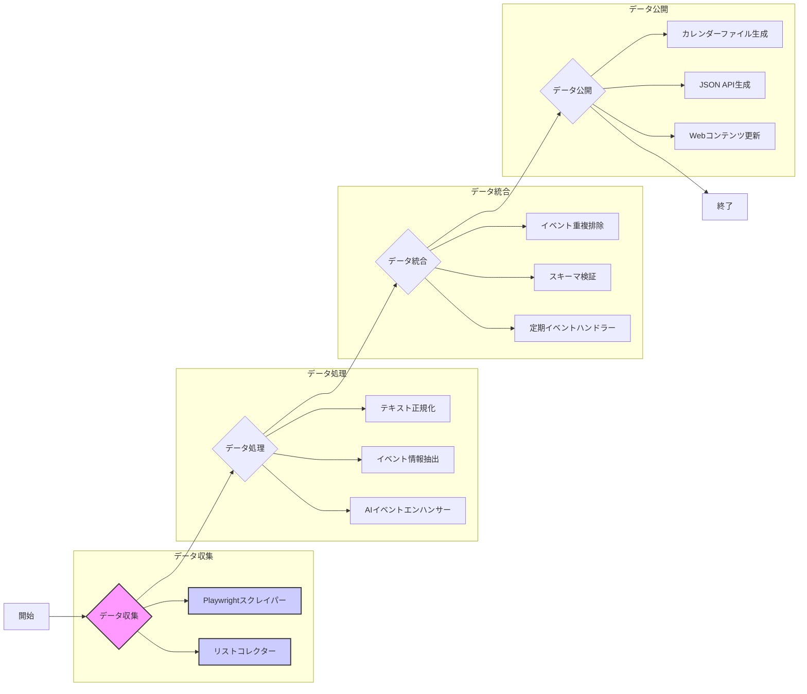

### 改訂された改善計画（日本語）

この計画は、VRChatイベントカレンダースクレイピングスクリプトの問題を解決するためのものです。ユーザーからのフィードバックに基づき、より明確で具体的な手順と説明を提供します。

#### 1. データ収集の問題への対処（最優先）

*   **1.1. 適切な待機処理の実装:**
    *   **アクション:** `playwright_scraper.py`と`list_collector.py`で、`asyncio.sleep()`を削除し、Playwrightの明示的な待機メソッドに置き換えます。
    *   **詳細:**
        *   `page.goto()`の**直後**に、`page.wait_for_load_state('networkidle', timeout=10000)`を使用して、初期ページロードを**最大10秒**待ちます。タイムアウトが発生した場合は、`logger.warning("Page load timed out")`のようなエラーログを出力します。
        *   ツイート本文、日付などの各要素を抽出する**直前**に、`tweet_element.locator("div[lang]").wait_for(timeout=5000)`のように、対象要素が確実に読み込まれるまで**最大5秒**待ちます。要素が見つからない場合は、別のロケータを試すか、`logger.warning("Element not found using primary locator")`のようなエラーログを出力します。
        *   スクロール処理では、`page.evaluate("window.scrollTo(0, document.body.scrollHeight)")`の**後**に、`page.locator("article:last-child").wait_for(timeout=3000)`を使用して、新しいツイート要素が**3秒以内**に表示されるのを待ちます。新しい要素が表示されない場合は、`logger.info("No new tweets loaded, stopping scroll")`のようなログを出力し、スクロールを停止します。
    *   **テスト:**
        *   スクレイピングスクリプトを実行し、実行時間と要素のロード動作を観察します。`time.sleep()`を使用するよりも効率的であることを確認します。
        *   すべての要素が正しくロードされることを確認するために、`page.screenshot(path="screenshot.png")`を使用してスクリーンショットを定期的に保存し、目視で確認します。
*   **1.2. 堅牢なロケータの実装:**
    *   **アクション:** `playwright_scraper.py`と`list_collector.py`で、ロケータ（セレクタ）を更新し、X.comのDOM変更に耐えられるようにします。
    *   **詳細:**
        *   ブラウザの開発者ツールを使用して、現在のX.comのHTML構造を**詳細に分析**します。特に、ツイートの構造、ユーザープロフィールの構造、リストページの構造を注意深く調べます。
        *   以下のPlaywright推奨ロケータAPIを優先的に使用します。
            *   `page.get_by_test_id(...)` (`data-testid`属性用)。`data-testid`属性が存在する場合は、**最優先**で使用します。例：`page.get_by_test_id("tweet").locator("div[lang]")`
            *   `page.get_by_role(...)` (アクセシビリティ属性用)。`role`属性が意味的に正しい場合は使用します（例: `role="link"`）。例：`page.get_by_role("link", name="View Tweet")`
            *   `page.get_by_text(...)` (特定の表示テキスト用)。テキストが**一意**であり、**変更されにくい**場合にのみ使用します。例：`page.get_by_text("返信")`
            *   XPathは、**上記のロケータがすべて失敗した場合**にのみ、最終手段として使用します。XPathを使用する場合は、できるだけ具体的なパスを指定し、`//`の使用は避けます。例：`//*[@id="react-root"]/div/div/div[2]/main/div/div/div/div[1]/div/div[2]/div/div/section/div/div/div[1]/div/div/article/div/div/div[2]/div[2]/div[1]/div/span`
        *   プライマリロケータが失敗した場合に、**複数の代替ロケータを試すフォールバックメカニズム**を実装します。例えば、ツイート本文の抽出に`div[lang]`が失敗した場合、以下の順に試すようにします。
            1.  `span[class*="Tweet-text"]`
            2.  `div[data-testid="tweetText"]`
            3.  XPath: `//*[@id="react-root"]/div/div/div[2]/main/div/div/div/div[1]/div/div[2]/div/div/section/div/div/div[1]/div/div/article/div/div/div[2]/div[2]/div[1]/div/span`
        *   フォールバックメカニズムの例：
            ```python
            try:
                tweet_text = await tweet_element.locator("div[lang]").inner_text()
            except:
                try:
                    tweet_text = await tweet_element.locator("span[class*='Tweet-text']").inner_text()
                except:
                    try:
                        tweet_text = await tweet_element.locator("div[data-testid='tweetText']").inner_text()
                    except:
                        try:
                            tweet_text = await tweet_element.locator('//*[@id="react-root"]/div/div/div[2]/main/div/div/div/div[1]/div/div[2]/div/div/section/div/div/div[1]/div/div/article/div/div/div[2]/div[2]/div[1]/div/span').inner_text()
                        except:
                            logger.warning("Failed to extract tweet text using any locator")
                            tweet_text = ""
            ```
    *   **テスト:**
        *   スクレイピングスクリプトを実行し、データが正確に抽出されることを確認します。
        *   抽出されたデータの精度と完全性を確認します。特に、異なる種類のツイート（画像付き、動画付き、リンク付きなど）でテストします。
        *   X.comのDOM構造を**意図的に変更**し（例: CSSクラス名を変更）、スクリプトが引き続き動作することを確認します。
*   **1.3. ログイン処理の実装:**
    *   **アクション:** `playwright_scraper.py`で、堅牢なログイン機能を実装します。
    *   **詳細:**
        *   `config/main_config.yaml`から認証情報を**安全に読み込み**ます。`os.environ`を使用して環境変数から読み込むオプションも追加します。
        *   `page.goto("https://twitter.com/login")`を使用してログインページに移動します。
        *   `page.locator("#username").fill(username)`と`page.locator("#password").fill(password)`を使用して、ユーザー名とパスワードを入力します。
        *   `page.locator("button[type='submit']").click()`を使用して、ログインボタンをクリックします。
        *   2要素認証が必要な場合は、`page.locator("#verification_code").fill(verification_code)`を使用して認証コードを入力し、`page.locator("button[type='submit']").click()`で送信します。
        *   ログインセッション（Cookieなど）を**暗号化**してファイルに保存します。`json`モジュールと`cryptography`ライブラリを使用します。
        *   スクリプトの開始時に、保存されたセッションが存在する場合は、それをロードして再利用します。
    *   **テスト:**
        *   ログイン資格情報ありとなしでスクレイピングスクリプトを実行します。
        *   スクリプトが正常にログインできることを確認します。
        *   セッションが保存され、正しく再利用されることを確認します。
        *   2要素認証を有効にして、スクリプトが正しく処理できることを確認します。
*   **1.4. スクロール処理の強化:**
    *   **アクション:** `playwright_scraper.py`で、無限スクロール処理を改善します。
    *   **詳細:**
        *   スクロール終了判定を強化します。高さ比較に加え、以下の条件を追加します。
            *   `page.locator(".r-1d09ksm").count() == 0`を使用して、「読み込み中」のスピナー要素が消えるのを待ちます。
            *   `time.time()`を使用して、新しいツイートが**5秒以内**に出現しない場合は、スクロールを停止します。
    *   **テスト:**
        *   スクレイピングスクリプトを実行し、多数のツイートをスクロールすることを確認します。
        *   スクロールが途中で停止しないことを確認します。
*   **1.5. データ検証とエラー処理の実装:**
    *   **アクション:** `playwright_scraper.py`と`list_collector.py`に、データ検証とエラー処理を追加します。
    *   **詳細:**
        *   `save_data`メソッド内でファイルサイズをチェックします（以前の計画どおり）。
        *   保存されたJSONファイルを再度読み込み、リストが空でないことを確認します (`len(data) > 0`)。
        *   抽出された各ツイートに必須フィールド（`tweet_id`, `text`, `url`, `date`）が存在することを確認します。
        *   データが収集されない場合、またはファイルが無効な場合は、**明確なエラーログを出力**し、必要であれば**異常終了ステータス(exit code 1)**でスクリプトを終了させます。
    *   **テスト:**
        *   さまざまなクエリとリストでスクレイピングスクリプトを実行します。
        *   データが検証され、エラーが正しく処理されることを確認します。
*   **1.6. Playwrightトレースの有効化:**
    *   **アクション:** `playwright_scraper.py`と`list_collector.py`で、Playwrightトレースを有効にするオプションを追加します。
    *   **詳細:**
        *   `--trace`コマンドライン引数を追加し、トレースを有効にするかどうかを指定します。
        *   トレースが有効な場合は、`context.tracing.start(screenshots=True, snapshots=True, sources=True)`を使用してトレースを開始し、スクリプトの最後に`context.tracing.stop(path="trace.zip")`を使用してトレースファイルを保存します。
    *   **テスト:**
        *   `python playwright_scraper.py --trace`のように、トレースを有効にしてスクレイピングスクリプトを実行します。
        *   `trace.zip`ファイルが生成され、役立つデバッグ情報が含まれていることを確認します。

#### 2. 中期的な改善（高優先度）

これらの改善は、スクレイピングプロセスの堅牢性と機能性を高めます。

*   **2.1. データ抽出の強化:**
    *   **アクション:** `playwright_scraper.py`で、より多くのツイート属性（画像、埋め込みリンク、ハッシュタグなど）を抽出します。
    *   **詳細:**
        1.  追加のツイート属性を抽出するためのセレクタを特定します。
        2.  これらの属性を抽出するロジックを`scrape_tweets`メソッドに追加します。
    *   **テスト:**
        1.  スクレイピングスクリプトを実行し、追加のツイート属性が正しく抽出されることを確認します。
        2.  抽出されたデータの精度と完全性を確認します。
*   **2.2. エラー回復メカニズムの実装:**
    *   **アクション:** `playwright_scraper.py`と`list_collector.py`で、エラー処理と再試行ロジックを実装します。
    *   **詳細:**
        1.  try-exceptブロックを実装して、潜在的な例外（ネットワークエラー、タイムアウトなど）をキャッチします。
        2.  一時的なエラーを処理するために、指数バックオフを使用した再試行ロジックを実装します。
        3.  プライマリスクレイピング戦略が失敗した場合に、代替スクレイピング戦略（異なるクエリ、異なるアプローチ）を実装します。

#### 3. 長期的な改善（中優先度）

これらの改善は、スケーラビリティ、データ品質、および保守性に焦点を当てます。

*   **3.1. 分散スクレイピングアーキテクチャの実装:**
    *   **アクション:** 複数のソースから同時にデータを収集できる分散スクレイピングアーキテクチャを設計します。
    *   **詳細:**
        1.  メッセージキュー（RabbitMQ、Kafkaなど）を使用して、スクレイピングタスクを複数のワーカーに分散します。
        2.  スクレイピングプロセスを監視し、ワーカーを管理するための中央コントロールパネルを実装します。
    *   **テスト:**
        1.  分散スクレイピングアーキテクチャをテスト環境にデプロイします。
        2.  システムが複数のソースから同時にデータを収集できることを確認します。
        3.  システムのパフォーマンスとスケーラビリティを監視します。
*   **3.2. AIデータエンハンスメントパイプラインの実装:**
    *   **アクション:** 要件定義書に記載されているGemini APIを使用したデータクレンジングおよびエンハンスメント機能を実装します。
    *   **詳細:**
        1.  `src/data_processing/ai_event_enhancer.py`にGemini API統合を実装します。
        2.  イベントデータの内容に基づいて適切なプロンプトを生成するロジックを実装します。
        3.  抽出されたイベント情報の精度を向上させ、欠落している情報を埋め、要約を生成するロジックを実装します。
    *   **テスト:**
        1.  データ処理パイプラインを実行し、Gemini APIが正しく呼び出されていることを確認します。
        2.  強化されたイベントデータの精度と完全性を確認します。
*   **3.3. 監視およびアラートシステムの実装:**
    *   **アクション:** スクレイピングプロセスを追跡し、問題が発生した場合に管理者に通知する監視およびアラートシステムを実装します。
    *   **詳細:**
        1.  監視ツール（Prometheus、Grafanaなど）を使用して、主要なメトリック（スクレイピング速度、エラー率、データ品質）を追跡します。
        2.  異常が発生した場合に管理者に通知するアラートルールを実装します。
    *   **テスト:**
        1.  監視およびアラートシステムをテスト環境にデプロイします。
        2.  エラーをシミュレートし、アラートが正しくトリガーされることを確認します。

### Mermaid図



### 実行計画

1.  **短期的な修正（最優先）:**
    *   `save_data`メソッドにファイルサイズチェックを実装します。
    *   Playwrightの待機処理を最適化します。
    *   `playwright_scraper.py`と`list_collector.py`のセレクタを更新します。
    *   ログイン処理を実装します。
    *   スクロール処理を強化します。
    *   データ検証とエラー処理を実装します。
    *   Playwrightトレースを有効にします。
2.  **中期的な改善（高優先度）:**
    *   データ抽出を強化します。
    *   エラー回復メカニズムを実装します。
3.  **長期的な改善（中優先度）:**
    *   分散スクレイピングアーキテクチャを実装します。
    *   AIデータエンハンスメントパイプラインを実装します。
    *   監視およびアラートシステムを実装します。
